# 项目简介

本项目 Module 1（模块1）：正常运行条件下的光伏发电功率预测。项目利用天气条件、时间信息与光伏运行数据，建立机器学习回归模型，对正常状态下的 Power Output（发电功率）进行预测。

当前项目已经完成数据预处理、真实数据样本收集、天气条件分类、多模型训练、模型评估、Feature Importance（特征重要性）分析，以及 Weather Impact（天气影响）分析。项目不仅比较不同模型，也使用实际统计结果解释模型表现差异，为后续 Module 2（模块2）的异常检测提供正常运行基准。

当前项目结构如下：

```text
PV/
  data/
    simulated_pv_data.csv
    clean_dataset.csv
    raw/
      real_pvdaq/
    processed/
      real_pvdaq_standardized.csv
      real_pvdaq_combined.csv
      sunny_dataset.csv
      cloudy_dataset.csv
      moderate_dataset.csv
      rainy_dataset.csv
      high_temperature_dataset.csv
      low_temperature_dataset.csv
      all_weather_dataset.csv
    weather_datasets/
      all_weather_dataset.csv
      sunny_dataset.csv
      cloudy_dataset.csv
    real_samples/
      README.md
      pvdaq_system_10_2023_01_01.csv
      pvdaq_systems_20250729.csv
  docs/
    progress_report.md
  results/
    missing_values.csv
    data_distribution.png
    weather_dataset_summary.csv
    weather_dataset_distribution.png
    model_metrics.csv
    best_models_by_dataset.csv
    model_comparison.png
    predicted_vs_actual.png
    prediction_results.csv
    feature_importance.csv
    feature_importance.png
    weather_analysis.csv
    weather_comparison.png
    weather_analysis_conclusion.txt
    correlation_matrix.csv
    correlation_heatmap.png
    actual_vs_predicted.png
    residual_plot.png
    error_distribution.png
    prediction_error_summary.csv
    predicted_power_baseline.csv
  src/
    preprocess_data.py
    create_weather_datasets.py
    train_model.py
    feature_importance_analysis.py
    weather_impact_analysis.py
  scripts/
    standardize_pvdaq_data.py
    merge_real_pvdaq_data.py
    create_operating_scenarios.py
    cross_validation_analysis.py
    hyperparameter_tuning.py
    correlation_analysis.py
    prediction_error_analysis.py
  README.md
  requirements.txt
```

详细的阶段性展示材料位于：

```text
docs/progress_report.md
```

依次展示数据样本、真实数据来源、缺失值检查、数据预处理、天气分类、多模型训练、模型评估、特征重要性、天气影响证据，以及模块1对模块2的支持。

# 项目目标

本项目的主要目标如下：

1. 建立正常运行条件下的光伏发电功率预测模型。
2. 比较不同机器学习模型在 All Weather（全天气）、Sunny（晴天）和 Cloudy（阴天）条件下的预测性能。
3. 分析 Irradiance（光照强度）、Temperature（温度）、Voltage（电压）和 Current（电流）对发电功率预测的影响。
4. 使用数据统计结果解释天气条件为什么会影响预测准确率。
5. 为模块2提供 Expected Normal Power Output（预期正常发电功率），用于识别潜在异常运行状态。

# 数据集介绍

项目同时保留模拟数据、清洗数据、天气分类数据和真实光伏数据样本。

- `data/simulated_pv_data.csv`：包含 8,760 条逐小时模拟光伏运行记录，用于验证完整项目流程。
- `data/clean_dataset.csv`：经过缺失值检查与异常值处理后的训练数据。
- `data/weather_datasets/all_weather_dataset.csv`：全天气数据集。
- `data/weather_datasets/sunny_dataset.csv`：晴天数据集。
- `data/weather_datasets/cloudy_dataset.csv`：阴天数据集。
- `data/real_samples/pvdaq_system_10_2023_01_01.csv`：真实分钟级光伏运行样本。

## 数据来源

真实数据样本来自 NREL（美国国家可再生能源实验室）与 DOE（美国能源部）的 PVDAQ（Photovoltaic Data Acquisition，光伏数据采集）公开数据集。

项目最初使用 PVDAQ system 10 在 2023-01-01 的分钟级数据进行流程验证。当前研究数据已经扩展至 8 个站点、2020–2023 四个年份和四个季节，数据来自 PVDAQ OEDI Public Data Lake：

```text
data/raw/real_pvdaq/
data/processed/multi_site_dataset.csv
data/processed/multi_year_dataset.csv
```

数据源：

- PVDAQ OEDI 数据页：https://data.openei.org/submissions/4568
- OEDI 公共数据湖：https://oedi-data-lake.s3.amazonaws.com/?prefix=pvdaq/csv/

真实样本包含交流或直流功率、环境或组件温度、Voltage（电压）、Current（电流）与阵列平面光照强度等字段。标准化流程根据传感器语义映射不同站点字段，并保留 `system_id` 与 `source_site`。

## 数据字段说明

当前模型使用的主要字段包括：

- `irradiance`：Irradiance（光照强度），表示到达光伏组件的太阳辐射水平。
- `ambient_temperature`：Ambient Temperature（环境温度）。
- `module_temperature`：Module Temperature（组件温度）。
- `humidity`：Humidity（湿度）。
- `wind_speed`：Wind Speed（风速）。
- `hour`：一天中的小时，用于表示日内变化规律。
- `day_of_year`：一年中的第几天，用于表示季节变化规律。
- `power_output`：Power Output（发电功率），是模型需要预测的目标变量。

真实 PVDAQ 样本还包含：

- `measured_on`
- `ac_power__423`
- `dc_power__422`
- `ambient_temp__428`
- `module_temp_1__429`
- `module_temp_2__430`
- `module_temp_3__431`
- `poa_irradiance__421`

## 真实 PVDAQ 数据字段统一

不同 PVDAQ 站点使用不同的传感器编号。例如，system 10 的交流电压字段为 `ac_voltage__426`，而 system 4 的对应字段为 `ac_voltage__318`。脚本 `scripts/standardize_pvdaq_data.py` 使用字段语义前缀自动完成映射，而不是依赖固定编号。

统一字段映射关系如下：

| 统一字段 | PVDAQ 原始字段匹配规则 |
|---|---|
| `time` | `measured_on`、`timestamp` 或 `time` |
| `irradiance` | `poa_irradiance__*`、`ghi__*` 或 `irradiance` |
| `temperature` | `ambient_temp__*`、`module_temp_1__*` 或 `temperature` |
| `voltage` | `ac_voltage__*`、`dc_pos_voltage__*` 或其他 voltage 字段 |
| `current` | `ac_current__*`、`dc_pos_current__*` 或其他 current 字段 |
| `power` | `ac_power__*`、`dc_power__*` 或其他 power 字段 |

统一后的数据输出到：

```text
data/processed/real_pvdaq_standardized.csv
```

统一 Voltage（电压）与 Current（电流）字段，可以使不同站点使用相同特征训练模型，也能够为模块2提供更直接的电气异常证据。如果某个原始文件缺少电压或电流传感器，脚本会使用缺失值进行兼容，不会中断整个处理流程。

运行字段统一：

```bash
python scripts/standardize_pvdaq_data.py
```

## 多站点与多日期真实数据整合

项目现在支持自动读取 `data/raw/real_pvdaq/` 下的所有 CSV 文件。当前扩展研究数据覆盖：

- 8 个 PVDAQ 站点，包含 Residential Proxy（住宅代理）、Commercial（商业）、Utility-scale（公用事业规模）和小型实验站点。
- 2020、2021、2022、2023 四个年份。
- Spring、Summer、Autumn、Winter 四个季节。
- `53,871` 条可用真实记录，相比原始 `5,760` 条样例增加 `48,111` 条，即约 `835%`。

合并脚本保留 `source_site`、`date` 和 `source_file` 信息，并输出：

```text
data/processed/real_pvdaq_combined.csv
```

更多站点与更多日期能够增加设备差异、天气变化和运行范围，从而提高模型的 Generalization Ability（泛化能力），降低模型仅适用于单一站点或单一天气条件的风险。

运行多文件合并：

```bash
python scripts/merge_real_pvdaq_data.py
```

## 多站点分析（Multi-Site Analysis）

脚本 `scripts/download_multi_site_pvdaq.py` 从 PVDAQ OEDI 公共数据湖下载可复现的季节代表日期样本。站点按 DC Capacity（直流额定容量）建立研究分类；该分类用于分析，不是 PVDAQ 官方站点标签。

| 研究类别 | 代表站点 | 容量范围 |
|---|---|---:|
| Residential Proxy | PVDAQ 2 | 2.912 kW |
| Commercial | PVDAQ 34 | 146.640 kW |
| Utility-scale | PVDAQ 14200、14201 | 1,000–1,340 kW |
| Small Experimental | PVDAQ 4、10、33、50 | 1–6 kW |

跨站点数据包含不同容量、逆变器、传感器语义与运行环境，能够检验模型是否只记住单一站点规律。统一输出为：

```text
data/processed/multi_site_dataset.csv
```

跨站点原始 Power 同时存在 W 与 kW 单位。验证脚本首先根据站点容量统一功率单位，再计算 `normalized_power = power_kw / dc_capacity_kw`。由于不同站点的 Voltage 和 Current 可能分别来自 AC 或 DC 侧，跨站点泛化验证仅使用语义一致的 Irradiance 与 Temperature，避免把传感器差异误认为模型能力。

## 多年份数据集（Multi-Year Dataset）

总体数据覆盖 2020–2023。PVDAQ 站点的年份覆盖并不一致：站点 4、10、33、50 覆盖四年；utility-scale 站点 14200、14201 覆盖 2020–2022；住宅代理站点 2 与商业站点 34 在当前可用样本中仅覆盖 2020。

长期数据可以包含设备老化、季节变化、年度天气差异和传感器漂移，因此比单月随机划分更适合验证未来数据稳定性。输出文件：

```text
data/processed/multi_year_dataset.csv
results/pvdaq_coverage_audit.csv
results/pvdaq_candidate_exclusions.csv
```

# 数据预处理

数据预处理脚本为 `src/preprocess_data.py`。该脚本执行以下步骤：

1. 读取原始 CSV 光伏数据。
2. 检查核心字段缺失值，并输出 `results/missing_values.csv`。
3. 删除不符合物理规律的异常值。
4. 使用 IQR（Interquartile Range，四分位距）方法删除极端统计异常值。
5. 生成清洗后的 `data/clean_dataset.csv`。
6. 使用 Matplotlib（Python 绘图库）生成清洗前后数据分布图 `results/data_distribution.png`。

当前数据预处理结果为：

- 原始数据：8,760 行。
- 清洗后数据：8,382 行。
- 删除异常或极端记录：378 行。
- 核心字段缺失值数量：0。

下面的图展示了数据清洗前后主要变量的分布变化。

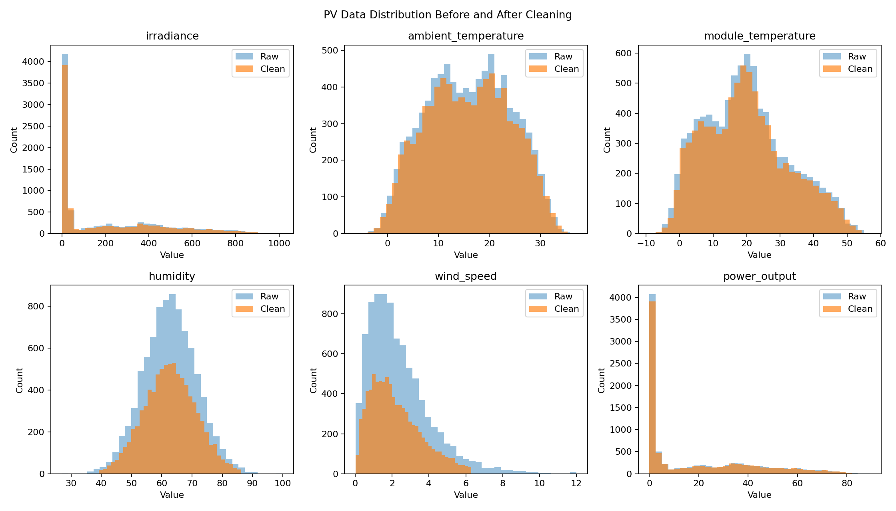

安装依赖并运行数据预处理：

```bash
pip install -r requirements.txt
```

```bash
python src/preprocess_data.py
```

# 天气条件分类

天气分类脚本为 `src/create_weather_datasets.py`。脚本首先筛选白天且存在有效发电的记录，再按照相同小时内的光照强度分位数划分天气条件。

采用同小时比较的原因是，早晨与傍晚的光照强度天然低于正午，因此不能仅使用固定光照阈值判断天气。当前分类规则如下：

- 同小时光照强度处于较高区间：`sunny`
- 同小时光照强度处于较低区间：`cloudy`
- 同小时光照强度处于中间区间：`moderate`
- 夜间或低功率记录：`night_or_low_power`

运行天气分类：

```bash
python src/create_weather_datasets.py
```

## 晴天数据集（Sunny Dataset）

Sunny Dataset（晴天数据集）包含 1,263 条记录，平均光照强度为 560.679，平均发电功率为 51.514 kW。该数据集具有较强的光照强度与发电功率关系。

```text
sunny:  1,263 rows, average irradiance 560.679
cloudy: 1,263 rows, average irradiance 275.080
```

## 阴天数据集（Cloudy Dataset）

Cloudy Dataset（阴天数据集）包含 1,263 条记录，平均光照强度为 275.080，平均发电功率为 26.340 kW。与晴天相比，阴天数据具有更高的相对光照波动，光照强度与发电功率之间的相关性也更弱，因此预测难度更高。

## 全天气数据集（All Weather Dataset）

All Weather Dataset（全天气数据集）包含 8,382 条记录，覆盖晴天、阴天、中等天气、夜间和低功率运行状态。该数据集样本数量最多，能够表示更广泛的运行范围，但其良好预测结果也需要结合较大的样本规模进行解释。

下面的图展示了晴天、阴天及其他天气条件下的数据分布差异。

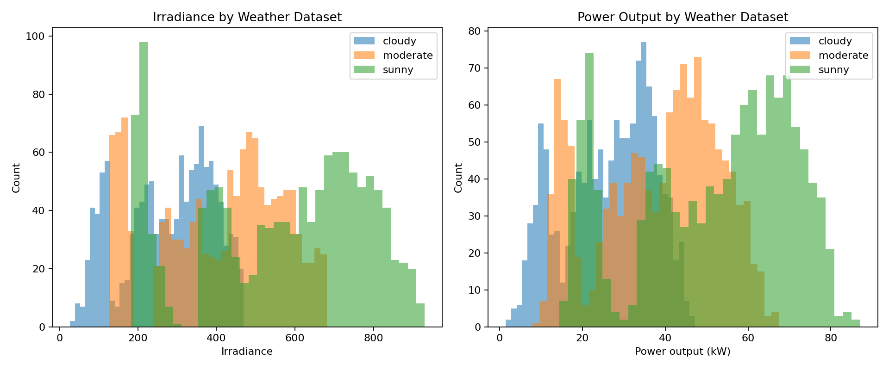

## 扩展运行场景分类

为增强模型对复杂运行条件的覆盖，脚本 `scripts/create_operating_scenarios.py` 在现有晴天、阴天和全天气条件基础上，新增以下场景：

- Moderate Weather（中等天气）：光照强度处于 250 至 600 的中等范围。
- Rainy Conditions（雨天条件）：由于当前 PVDAQ 样本没有真实降雨字段，使用“低光照强度 + 高滚动波动”作为 Proxy Rule（代理规则）。
- High Temperature Conditions（高温条件）：温度高于真实合并数据的第 75 分位数。
- Low Temperature Conditions（低温条件）：温度低于真实合并数据的第 25 分位数。

当前场景数据量如下：

| 场景 | 记录数 |
|---|---:|
| Sunny | 233 |
| Cloudy | 1,315 |
| Moderate | 436 |
| Rainy proxy | 88 |
| High Temperature | 1,440 |
| Low Temperature | 1,440 |
| All Weather | 5,760 |

增加更多天气和温度场景，可以检验模型在不同运行状态下是否稳定，并为模块2建立更细分的正常运行基准。所有场景数据保存于 `data/processed/`。

运行扩展场景分类：

```bash
python scripts/create_operating_scenarios.py
```

# 机器学习模型

训练脚本 `src/train_model.py` 在三个天气数据集上训练并比较以下已有回归模型：

- Linear Regression（线性回归）
- Ridge Regression（岭回归）
- Lasso Regression（套索回归）
- KNN Regressor（K近邻回归）
- SVR（支持向量回归）
- Decision Tree（决策树）
- Random Forest（随机森林）
- Extra Trees（极端随机树）
- Gradient Boosting（梯度提升树）

本项目不假设某个模型在所有天气条件下均表现最佳，而是通过已有的 MAE、RMSE 和 R² 结果选择各数据集的最佳模型。

运行多数据集、多模型训练和比较：

```bash
python src/train_model.py
```

# 模型评估指标

模型评估结果保存于 `results/model_metrics.csv`，各天气数据集的最佳模型保存于 `results/best_models_by_dataset.csv`。项目使用 MAE、RMSE 和 R² 对预测性能进行评价。

## 平均绝对误差（MAE）

MAE（Mean Absolute Error，平均绝对误差）表示预测值与真实值之间绝对误差的平均值，单位为 kW。MAE 越小，说明模型的平均预测偏差越小。

## 均方根误差（RMSE）

RMSE（Root Mean Squared Error，均方根误差）对较大的预测误差更加敏感。RMSE 越小，说明模型出现大误差的程度越低。本项目以 RMSE 最低作为选择各数据集最佳模型的主要依据。

## 决定系数（R²）

R²（Coefficient of Determination，决定系数）用于衡量模型对发电功率变化的解释能力。R² 越接近 1，说明模型能够解释的数据变化比例越高。

## 交叉验证分析（Cross Validation Analysis）

脚本 `scripts/cross_validation_analysis.py` 使用 K-Fold Cross Validation（K折交叉验证），对以下主要模型在七个运行场景中的稳定性进行验证：

- Linear Regression
- Lasso Regression
- Random Forest Regressor
- Gradient Boosting Regressor

交叉验证通过多次改变训练集与验证集划分，减少单次随机划分对结果的影响。结果保存于：

- `results/cross_validation_results.csv`
- `results/cross_validation_comparison.png`

现有真实数据上的主要结论如下：

- Random Forest 在七个场景中的平均 CV RMSE 最低，为 `4.2255`，整体平均表现最佳。
- Gradient Boosting 的平均 RMSE 标准差最低，为 `1.1005`，从跨场景平均结果看更加稳定。
- Random Forest 在 All Weather、Cloudy、Moderate 和 Low Temperature 场景表现最佳。
- Gradient Boosting 在 Sunny、Rainy proxy 和 High Temperature 场景表现最佳。
- 不同运行场景的最佳模型并不一致，说明场景差异会影响模型选择。

下面的图展示了不同模型在各运行场景中的平均交叉验证 RMSE。

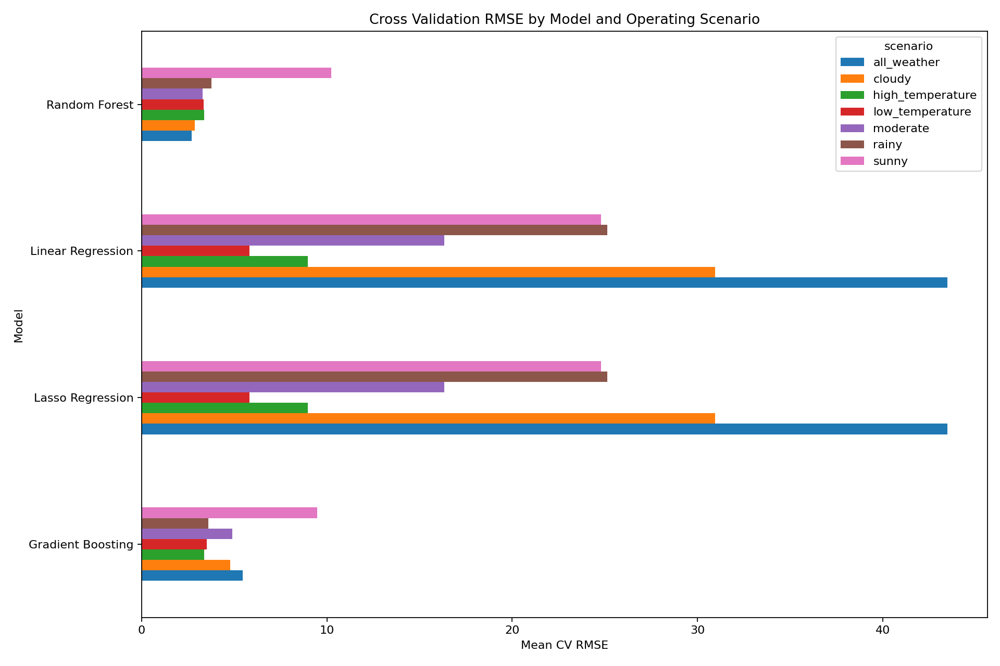

运行交叉验证分析：

```bash
python scripts/cross_validation_analysis.py
```

## 超参数优化（Hyperparameter Optimization）

脚本 `scripts/hyperparameter_tuning.py` 使用 GridSearchCV（网格搜索交叉验证），对 Random Forest 和 Gradient Boosting 进行超参数优化。

优化参数包括：

- Random Forest：`n_estimators`、`max_depth`、`min_samples_split`。
- Gradient Boosting：`n_estimators`、`learning_rate`、`max_depth`。

当前最优参数与结果如下：

| 模型 | 最优参数 | 基准 CV RMSE | 优化后 CV RMSE | RMSE 改善 |
|---|---|---:|---:|---:|
| Random Forest | `max_depth=14, min_samples_split=2, n_estimators=200` | 2.7017 | 2.6887 | 0.0130 |
| Gradient Boosting | `learning_rate=0.08, max_depth=4, n_estimators=200` | 4.9400 | 3.2096 | 1.7304 |

Random Forest 优化后仅小幅提升，说明其基准参数已经较合理。Gradient Boosting 的 CV RMSE 明显下降，说明调参提高了其预测可靠性。由于优化目标来自多折交叉验证，而不是单一测试集，因此能够在一定程度上降低过拟合风险。

输出与最优模型：

- `results/hyperparameter_tuning_results.csv`
- `models/best_random_forest.pkl`
- `models/best_gradient_boosting.pkl`

运行超参数优化：

```bash
python scripts/hyperparameter_tuning.py
```

# 实验结果

已有实验结果表明，不同天气条件下的最佳模型不同：

```text
all_weather: Gradient Boosting, RMSE 1.1550, R2 0.9973
sunny:       Random Forest,     RMSE 1.5607, R2 0.9927
cloudy:      Lasso Regression,  RMSE 1.6843, R2 0.9738
```

天气条件最佳模型的完整指标如下：

```text
all_weather: R2 0.9973, MAE 0.7014, RMSE 1.1550
sunny:       R2 0.9927, MAE 1.1837, RMSE 1.5607
cloudy:      R2 0.9738, MAE 1.3266, RMSE 1.6843
```

下面的图比较了不同模型在各天气数据集上的 RMSE 表现。

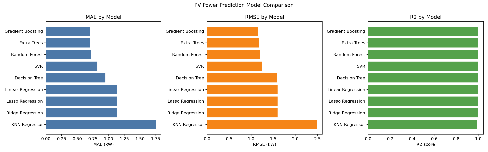

下面的图展示了各数据集最佳模型的预测功率与实际功率关系。

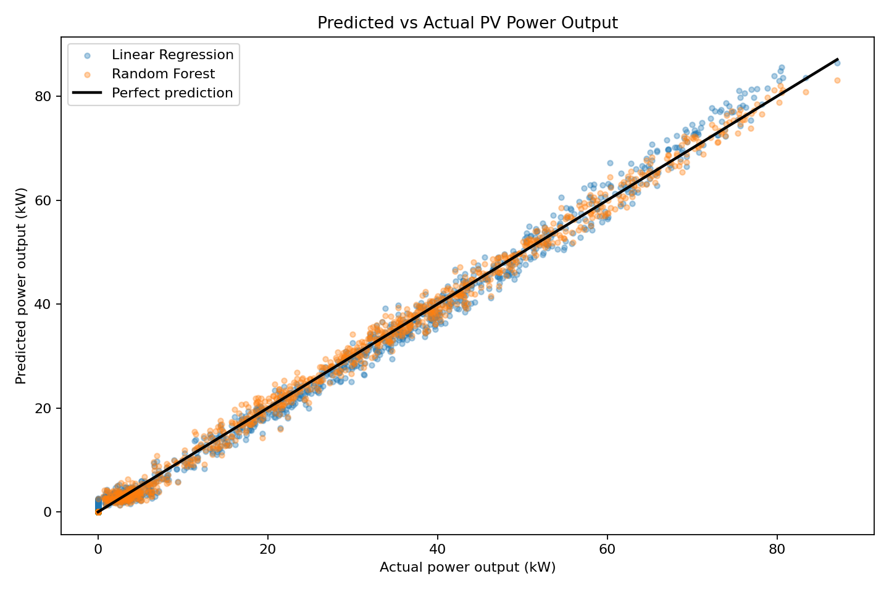

## 全天气（All Weather）

All Weather（全天气）条件下，Gradient Boosting（梯度提升树）表现最佳，其 MAE 为 0.7014、RMSE 为 1.1550、R² 为 0.9973。

Gradient Boosting 能够逐步组合多个弱学习器，对广泛运行范围中的非线性关系进行细致修正。全天气数据集样本数量较多，并包含多种运行状态，这可能解释了 Gradient Boosting 的性能优势。

## 晴天（Sunny）

Sunny（晴天）条件下，Random Forest（随机森林）表现最佳，其 MAE 为 1.1837、RMSE 为 1.5607、R² 为 0.9927。

晴天数据具有较强且相对稳定的光照强度与发电功率关系。Random Forest 能够学习主要光照规律，同时捕捉温度和时间特征带来的次要非线性影响。

## 阴天（Cloudy）

Cloudy（阴天）条件下，Lasso Regression（套索回归）表现最佳，其 MAE 为 1.3266、RMSE 为 1.6843、R² 为 0.9738。

阴天数据具有较弱的光照强度与发电功率相关性，并且相对光照波动更高。Lasso Regression 的正则化机制能够限制复杂度，在规模较小、稳定性较低的数据集中降低过拟合风险。

# 特征重要性分析

Feature Importance Analysis（特征重要性分析）用于解释不同输入特征对 Power Output（发电功率）预测的影响程度。

分析方法如下：

- 树模型使用 `feature_importances_`。
- 线性模型使用标准化后的系数绝对值。
- `temperature` 由 `ambient_temperature` 和 `module_temperature` 的重要性合并得到。
- 所有输出按重要性自动排序。

本项目不再将模拟天气数据 Feature Importance 与真实 PVDAQ 四特征模型 Feature Importance 直接比较，因为两者的数据来源、字段定义和实验目标不同。原有结果继续保留为补充材料，但 Module 1 的主要结论来自下文使用同一份真实 PVDAQ 数据完成的 Experiment A 与 Experiment B。

补充结果文件包括：

- `results/feature_importance.csv`
- `results/feature_importance.png`
- `results/feature_importance_all_weather.csv`
- `results/feature_importance_sunny.csv`
- `results/feature_importance_cloudy.csv`
- `results/feature_importance_comparison.png`

运行特征重要性分析：

```bash
python src/feature_importance_analysis.py
```

```bash
python scripts/feature_importance_analysis.py
```

## 环境预测模型与电气增强模型对比

本节包含两个独立训练的真实 PVDAQ Random Forest 实验。两个实验使用相同的 5,760 条真实数据、相同的 tuned Random Forest（调优随机森林）参数和相同的 5-fold Out-of-Fold Validation（五折折外验证），唯一差异是输入特征。

- **实验 A：Environment-based Model（环境预测模型）**
  - 输入：Irradiance、Temperature
  - 输出：Power
  - 用途：研究环境因素对正常发电能力的影响，并建立正常工况预测基准。
- **实验 B：Electrical-assisted Model（电气增强模型）**
  - 输入：Irradiance、Temperature、Voltage、Current
  - 输出：Power
  - 用途：研究电气参数对预测精度的提升，并作为运行状态监测参考。

## Feature Leakage Discussion（特征泄漏讨论）

真实 PVDAQ 训练数据的数据质量检查表明，Current、Voltage、Irradiance、Temperature 和 Power 均没有缺失值，也不是常数列：

| Feature | Min | Max | Mean | Std | Missing |
|---|---:|---:|---:|---:|---:|
| Current | 0.1739 | 8.8396 | 1.6752 | 1.1085 | 0 |
| Voltage | 115.4500 | 119.4433 | 117.4963 | 0.6365 | 0 |
| Irradiance | 0.0000 | 1325.5000 | 89.7131 | 199.9551 | 0 |
| Temperature | -8.3368 | 4.9055 | -2.0035 | 2.6802 | 0 |
| Power | 0.0000 | 1017.6000 | 62.8619 | 147.6295 | 0 |

Power 与主要输入特征的 Pearson Correlation（皮尔逊相关系数）为：

| Feature | Correlation with Power |
|---|---:|
| Irradiance | 0.9107 |
| Current | 0.8493 |
| Temperature | 0.4078 |
| Voltage | 0.3544 |

Current 在真实数据 Electrical-assisted Model（电气辅助模型）中的重要性达到 `93.14%`，主要原因是 Power 与 Current 存在直接电气关系：

```text
Power ≈ Voltage × Current × Power Factor
```

这不表示模型或字段映射错误。Current 数据具有正常变化且不存在缺失；它对 Power 具有非常强的直接解释能力。但对于“根据环境条件预测正常发电能力”的研究目标，使用同一时刻的 Current 和 Voltage 会形成 Target Leakage Risk（目标泄漏风险）或 Target Proxy Risk（目标代理风险）：模型可能直接重建已测量 Power，而不是学习天气条件与正常发电能力之间的关系。

因此，本项目同时保留两种输入设计：

1. **Environment-based Model（环境模型）**：用于研究环境因素并建立正常工况预测基准。
2. **Electrical-assisted Model（电气辅助模型）**：用于研究电气参数带来的精度提升，并作为运行状态监测参考。

两种模型均使用相同 tuned Random Forest 参数、相同 5-fold shuffled out-of-fold validation 和相同 5,760 条记录：

| Model | MAE | RMSE | R² |
|---|---:|---:|---:|
| Environment-based Model | 2.5414 | 7.1595 | 0.997648 |
| Electrical-assisted Model | 0.7328 | 2.7112 | 0.999663 |

加入电气测量后 RMSE 降低约 `62.1%`。该提升是真实的预测提升，但并不等同于环境条件基准能力提升。Environment-based Model 的 Feature Importance 为 Irradiance `89.84%`、Temperature `10.16%`；Electrical-assisted Model 则由 Current `93.14%` 主导。

最终实验定位如下：

- 实验 A 更适合作为正常工况预测基准。
- 实验 B 更适合作为运行状态监测参考。

下面的图展示真实数据特征相关性。

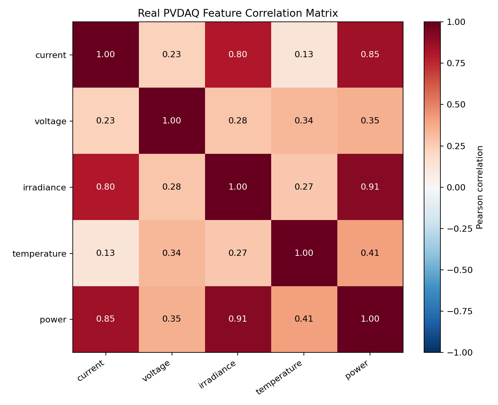

下面的图比较两种输入设计的折外预测性能。

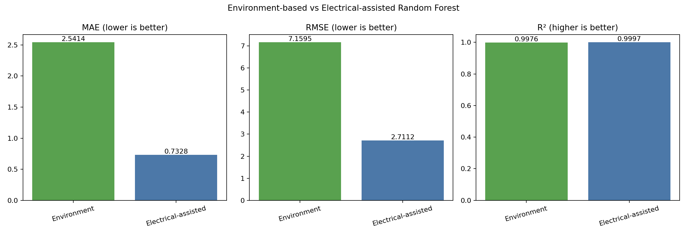

下面两张图分别展示 Environment-based Model 和 Electrical-assisted Model 的特征重要性。

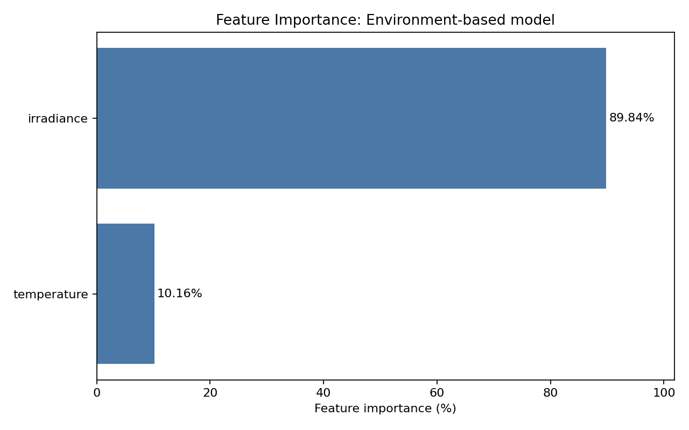

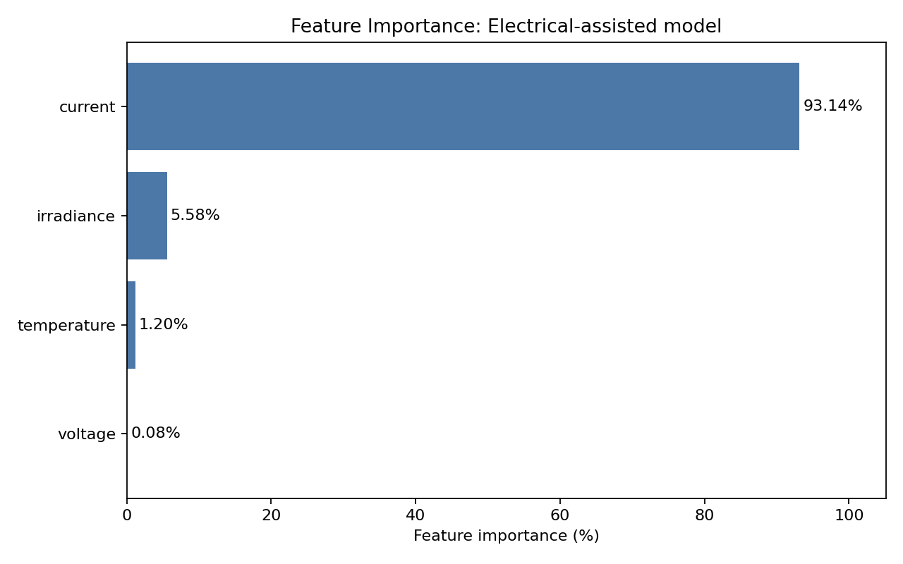

输出文件：

- `results/real_data_feature_quality_report.csv`
- `results/real_data_correlation_report.csv`
- `results/real_data_correlation_heatmap.png`
- `results/environment_vs_electrical_model_comparison.csv`
- `results/environment_vs_electrical_model_comparison.png`
- `results/feature_importance_environment_model.csv`
- `results/feature_importance_environment_model.png`
- `results/feature_importance_electrical_model.csv`
- `results/feature_importance_electrical_model.png`
- `results/predicted_power_environment_baseline.csv`
- `results/predicted_power_electrical_assisted_baseline.csv`
- `models/environment_based_random_forest.pkl`
- `models/electrical_assisted_random_forest.pkl`

运行分析：

```bash
python scripts/feature_input_design_analysis.py
```

# 相关性分析

Correlation Analysis（相关性分析）使用真实 PVDAQ 统一数据，计算 Irradiance、Temperature、Voltage、Current 与 Power 之间的 Pearson Correlation（皮尔逊相关系数）。

与 Power 的相关性结果如下：

| 特征 | 与 Power 的相关系数 |
|---|---:|
| Irradiance | 0.9107 |
| Current | 0.8493 |
| Temperature | 0.4078 |
| Voltage | 0.3544 |

Irradiance 与 Power 的线性相关性最高，说明太阳能输入仍然是发电功率变化的主要外部驱动因素。Current 与 Power 也具有很强相关性，符合功率与电流之间的直接电气关系。Temperature 与 Voltage 的相关性较弱，但仍能够提供次要运行状态信息。

下面的热力图展示了真实 PVDAQ 模型变量之间的相关关系。

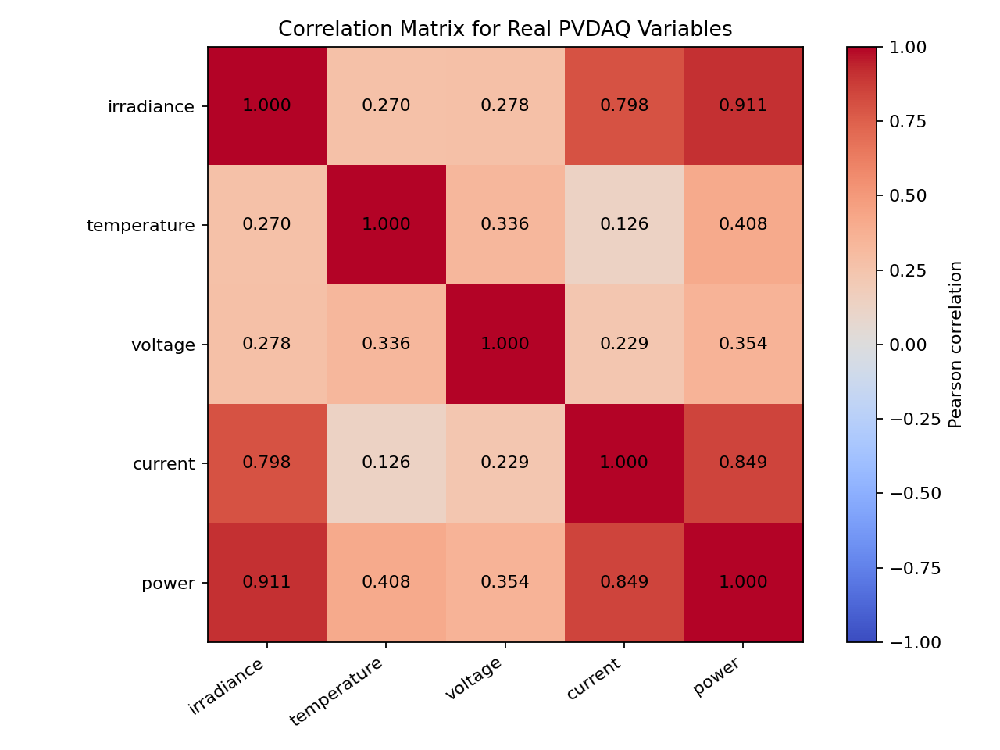

输出文件：

- `results/correlation_matrix.csv`
- `results/correlation_heatmap.png`

运行相关性分析：

```bash
python scripts/correlation_analysis.py
```

# 预测误差分析

Prediction Error Analysis（预测误差分析）使用已调优 Random Forest 和 5-fold Out-of-Fold Prediction（折外预测）。每条数据均由未使用该记录训练的模型生成预测，因此误差结果比训练集内预测更可靠。

整体误差结果如下：

```text
MAE:  0.7328
RMSE: 2.7112
R²:   0.9997
Mean residual: -0.0365
```

整体平均残差接近 0，说明模型没有明显的全局系统性高估或低估。然而，不同运行条件下的误差差异明显：

| 天气条件 | MAE | RMSE | Mean residual |
|---|---:|---:|---:|
| Night or low power | 0.0178 | 0.2116 | -0.0063 |
| Cloudy | 1.2366 | 2.4691 | -0.1207 |
| Moderate | 2.2358 | 4.0066 | 0.5216 |
| Sunny | 6.6643 | 10.7956 | -1.0945 |

Sunny 高功率场景的预测误差最大，主要原因包括高功率区间样本较少、功率绝对变化范围更大，以及不同站点在高功率运行时存在差异。Sunny 的平均残差为负，表示模型在该场景存在轻微整体高估；Moderate 的平均残差为正，表示存在轻微整体低估。

下面的图展示了折外预测值与实际值的关系。

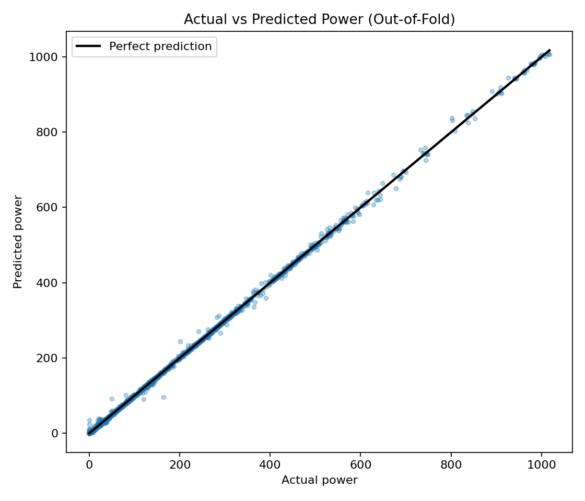

下面的残差图用于检查模型是否存在系统性误差。

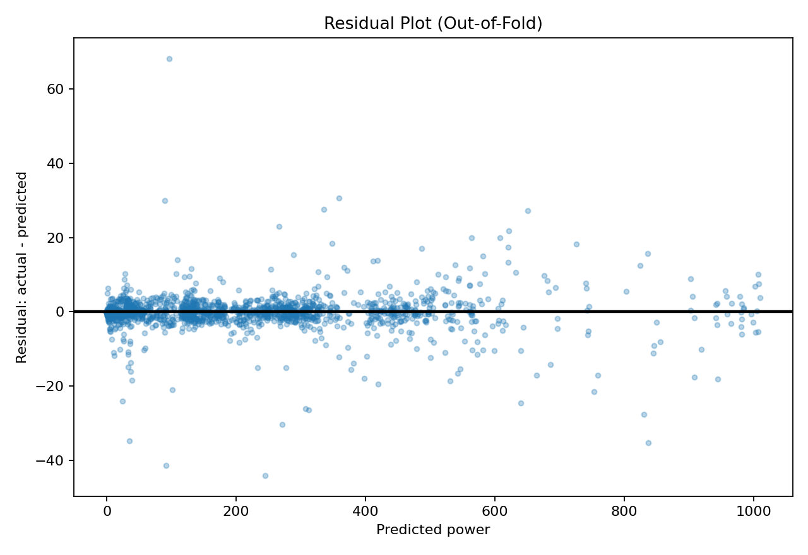

下面的直方图展示了预测误差分布。

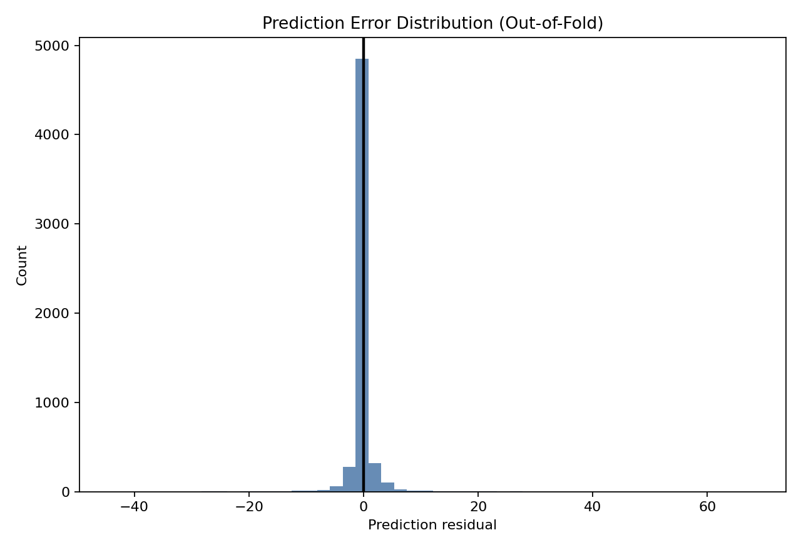

输出文件：

- `results/actual_vs_predicted.png`
- `results/residual_plot.png`
- `results/error_distribution.png`
- `results/prediction_error_summary.csv`

运行预测误差分析：

```bash
python scripts/prediction_error_analysis.py
```

# 天气影响分析

Weather Impact Analysis（天气影响分析）使用已有模型指标和实际数据统计结果，解释不同天气条件对预测性能的影响。

天气条件最佳模型的性能比较如下：

- 全天气数据集整体预测最准确，最佳模型为 Gradient Boosting。
- 晴天数据集预测性能居中，最佳模型为 Random Forest。
- 阴天数据集预测最困难，最佳模型为 Lasso Regression。

三个数据集的天气统计证据如下：

| Dataset | Irradiance mean | Irradiance std | Irradiance CV | Power mean | Power std | Irradiance-power correlation |
|---|---:|---:|---:|---:|---:|---:|
| all_weather | 194.169 | 244.163 | 1.257 | 18.038 | 22.573 | 0.9973 |
| sunny | 560.679 | 214.581 | 0.383 | 51.514 | 18.737 | 0.9930 |
| cloudy | 275.080 | 112.726 | 0.410 | 26.340 | 10.621 | 0.9866 |

晴天数据的相对光照波动低于阴天数据，光照强度变异系数分别为 0.383 和 0.410。同时，晴天条件下光照强度与发电功率的相关系数为 0.9930，高于阴天条件下的 0.9866。

虽然晴天光照强度的绝对标准差更高，但这是因为晴天的整体光照水平明显更高。从相对波动角度看，阴天光照变化更不稳定，且光照强度与发电功率之间的关系更弱。这些统计差异能够解释阴天条件下 R² 较低、MAE 与 RMSE 较高的现象。

全天气数据集包含夜间和低功率记录，并拥有更多训练样本，因此其良好预测性能需要结合样本规模与运行范围进行解释。

下面的图展示了不同天气条件下的 R² 与 MAE 对比。

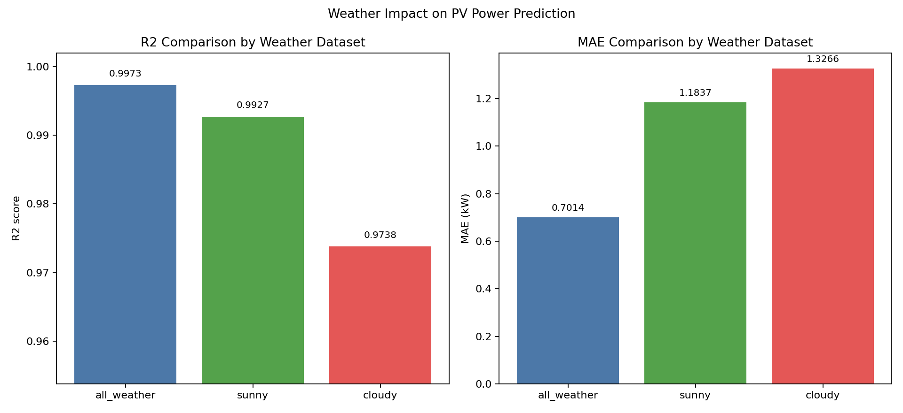

下面的图使用光照强度、发电功率和相关系数等统计量，为天气影响结论提供数据证据。

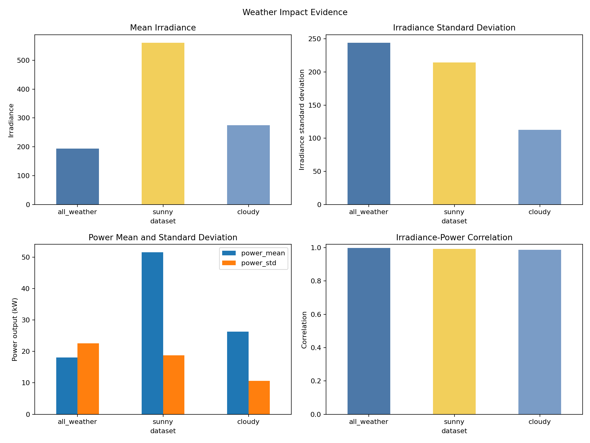

输出文件包括：

- `results/weather_analysis.csv`
- `results/weather_comparison.png`
- `results/weather_analysis_conclusion.txt`
- `results/weather_statistics.csv`
- `results/weather_statistics.png`

运行天气影响分析：

```bash
python src/weather_impact_analysis.py
```

```bash
python scripts/weather_impact_analysis.py
```

# 模块1对模块2的支持

模块1用于预测正常天气与正常运行状态下的 Expected Normal Power Output（预期正常发电功率）。模块2可以将实际测量功率与模块1预测的正常功率进行比较：

```text
prediction residual = actual power - expected normal power
```

当 Prediction Residual（预测残差）持续较大时，可能表示系统存在异常运行状态，例如局部遮挡、组件积灰、逆变器问题、传感器故障或其他光伏系统故障。

通过建立晴天、阴天和全天气条件下的正常性能基准，模块2能够区分天气变化造成的正常功率波动与设备异常造成的异常功率偏差，从而减少仅由天气变化引起的误报。

原有模拟数据模型尚未使用 Voltage（电压）和 Current（电流）。新增真实数据处理流程已将这两个字段纳入统一真实数据，可用于后续真实数据模型与模块2分析。

新增真实数据处理流程已经将 Voltage 与 Current 映射到统一数据字段。输入设计对比证明，使用 Current 和 Voltage 的 Electrical-assisted Model 会显著降低 Prediction Error，但也可能使模型通过直接电气关系重建 Power，从而掩盖同时影响 Current 和 Power 的故障。

因此，Module 2 不应只依赖 Power Prediction Error（功率预测误差），也不应只使用 Electrical-assisted Model 的低残差作为正常判断。推荐联合使用：

- Environment-based Model 的 `prediction_error`
- Voltage Abnormality（电压异常）
- Current Fluctuation（电流波动）
- Irradiance-Power Mismatch（光照强度与功率不匹配）

Environment-based Model 用于判断当前天气条件下“应该产生多少功率”；Electrical-assisted Model 与电压、电流规则用于判断系统实际电气状态是否合理。两类证据联合使用，可以减少电气故障被低 Prediction Error 掩盖的风险。

Module 2 应优先使用以下环境模型正常功率基线：

```text
results/predicted_power_environment_baseline.csv
```

原有 `results/predicted_power_baseline.csv` 与新增 `results/predicted_power_electrical_assisted_baseline.csv` 作为电气辅助模型结果保留，用于对比与运行状态诊断，不作为唯一异常判断依据。

扩展场景分类也能降低异常检测误报。例如，低光照、高温或 Rainy proxy 场景下的正常功率下降不应直接判定为设备故障，而应与对应场景的正常预测基准进行比较。

项目同时保留原有电气辅助功率基线，用于与环境模型基线进行诊断对比：

```text
results/predicted_power_baseline.csv
```

上述基线文件均由折外预测生成，核心字段包括：

- `time`
- `actual_power`
- `predicted_power`
- `prediction_error`

模块2可以根据 `prediction_error` 的绝对值和持续时间设置异常阈值。单次较大误差可能来自传感器噪声或天气突变，而持续的大幅误差更可能表示遮挡、积灰、逆变器问题或其他故障。

# 季节分析（Seasonal Analysis）

季节分析使用日间正常范围数据，并通过留一站点验证计算各季节的跨站点预测误差：

| 季节 | 日间样本数 | Irradiance Mean | Temperature Mean | Mean Power | Cross-Site RMSE | R² |
|---|---:|---:|---:|---:|---:|---:|
| Spring | 5,971 | 438.38 | 9.18 | 26.57 kW | 0.0789 | 0.9258 |
| Summer | 4,675 | 415.82 | 24.06 | 42.23 kW | 0.1480 | 0.6126 |
| Autumn | 4,133 | 553.96 | 11.57 | 32.01 kW | 0.0463 | 0.9650 |
| Winter | 6,943 | 410.44 | 2.31 | 15.03 kW | 0.1135 | 0.8408 |

当前采样数据中，Summer 的平均原始发电功率最高；按容量归一化后，Autumn 的平均输出最高。Summer 的跨站点 RMSE 最大、R² 最低，因此是当前最难迁移预测的季节。该结果说明温度、站点组成和季节性辐照分布会影响模型性能，但由于数据采用季节代表日而非完整全年连续记录，不能将其解释为全年总发电量结论。

下面的图比较四季的光照、温度和跨站点预测误差。

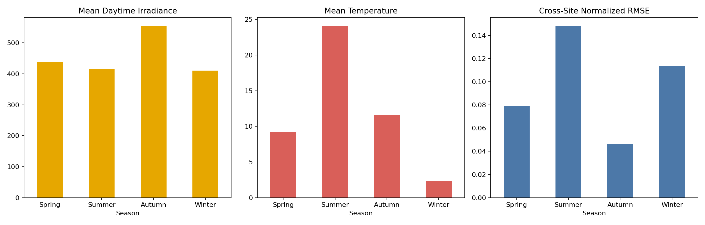

输出文件：

- `results/seasonal_statistics.csv`
- `results/seasonal_comparison.png`

# 跨站点泛化（Cross-Site Generalization）

Cross-Site Validation（跨站点验证）采用 Leave-One-Site-Out（留一站点）方法：每次使用其他 7 个站点训练，并在一个完全未见过的站点测试。为解决不同站点容量和 W/kW 单位差异，预测目标使用容量归一化功率。

主要结果：

- 两个 Utility-scale 站点的 R² 分别为 `0.9272` 和 `0.9451`，说明环境特征模型可以在相似大型站点之间迁移。
- PVDAQ 33 与 PVDAQ 10 的 R² 分别为 `0.9414` 和 `0.8773`。
- 所有站点的中位 RMSE 为 `0.0997`，中位 R² 为 `0.8336`。
- PVDAQ 34 仅有 36 条可用于验证的日间记录；PVDAQ 50 的有效发电变化极少。这两个站点的负 R² 主要反映样本质量与覆盖不足，不能视为稳定泛化结论。

因此，模型能够迁移到部分新站点，但泛化能力依赖目标站点是否具有足够、具有代表性的正常发电样本。输出：

```text
results/cross_site_validation.csv
```

# 时间泛化（Temporal Generalization）

时间序列验证使用 Expanding Window（扩展窗口）：仅使用过去年份训练，并测试未来年份。它与随机 K-Fold 的结果差异如下：

| 验证方法 | 测试年份 | RMSE | R² |
|---|---|---:|---:|
| Random KFold | Mixed 2020–2023 | 0.0641 | 0.9457 |
| Train 2020 → Test 2021 | 2021 | 0.1014 | 0.8869 |
| Train 2020–2021 → Test 2022 | 2022 | 0.1626 | 0.6750 |
| Train 2020–2022 → Test 2023 | 2023 | 0.1220 | 0.4451 |

未来年份上的性能明显低于随机 K-Fold。这证明随机划分会因相邻时间记录与相似运行状态同时进入训练和测试集而高估模型泛化能力。输出：

```text
results/time_series_validation.csv
```

# 数据集覆盖改进（Dataset Coverage Improvement）

本轮扩展将项目从 2 个站点、单月少量日期的样例验证，升级为 8 个站点、4 个年份和四季代表日期的跨站点研究样本。

| 覆盖指标 | 扩展前 | 扩展后 |
|---|---:|---:|
| 站点数 | 2 | 8 |
| 年份数 | 1 | 4 |
| 季节数 | 1 | 4 |
| 可用记录数 | 5,760 | 53,871 |
| 记录增长 | - | +48,111（约 +835%） |

候选站点 1199、1200、1332 和 1430 未纳入统一研究数据：1199 缺少 Irradiance 与 Temperature；1200 缺少环境、电压和电流字段；1332 缺少 Irradiance 与 Temperature；1430 缺少 Power。详细原因保存在 `results/pvdaq_candidate_exclusions.csv`。

运行完整覆盖与验证分析：

```bash
python scripts/download_multi_site_pvdaq.py
python scripts/standardize_pvdaq_data.py
python scripts/dataset_coverage_analysis.py
python scripts/seasonal_analysis.py
python scripts/cross_site_validation.py
python scripts/time_series_validation.py
```

# 关键发现（Key Findings）

1. **哪个模型表现最好？**
   在真实 PVDAQ 数据的交叉验证中，Random Forest 的跨场景平均 CV RMSE 最低，为 `4.2255`；其调优后 All Weather CV RMSE 为 `2.6887`。因此，Random Forest 是当前真实数据管线中整体表现最好的模型。

2. **哪个特征最重要？**
   在 Electrical-assisted Model 中，Current 的特征重要性最高，为 `93.14%`，这是直接电气关系造成的目标代理效应；在更适合作为正常发电基准的 Environment-based Model 中，Irradiance 的重要性最高，为 `89.84%`。

3. **天气是否影响模型性能？**
   是。交叉验证与折外误差结果均显示，不同天气和运行场景的最佳模型、MAE 与 RMSE 并不一致。

4. **为什么天气影响模型性能？**
   不同天气改变光照强度水平、波动程度和有效样本分布。高功率 Sunny 场景样本较少且绝对功率变化更大，因此当前真实数据模型在 Sunny 场景的误差最高。

5. **模块1如何支持模块2？**
   模块1优先使用 Environment-based Model 提供正常预期功率和折外预测残差。模块2联合使用预测误差、电压异常、电流波动和 Irradiance-Power Mismatch 判断异常，避免只依赖 Electrical-assisted Model 的低残差。

6. **模型能否迁移到新站点和未来年份？**
   模型在多数具有充分样本的未见站点上能够保持有效预测，跨站点中位 R² 为 `0.8336`。但未来年份验证的 R² 从 `0.8869` 下降到 `0.4451`，明显低于随机 K-Fold 的 `0.9457`，说明时间变化和站点覆盖仍是主要泛化风险。

# 项目结论

本项目完成了从数据准备、数据预处理、天气分类、多模型训练、模型评估到结果解释的完整流程。

主要结论如下：

1. Environment-based Model 表明 Irradiance 是正常发电能力预测中最重要的环境驱动因素；Electrical-assisted Model 中 Current 是最重要的直接电气特征，但其高重要性包含明显的目标代理风险。
2. 真实数据交叉验证表明 Random Forest 整体平均表现最佳，而不同天气和温度场景仍可能偏好不同模型。
3. 相关性、交叉验证和预测误差结果共同证明，天气条件、样本分布与功率范围会影响模型预测性能。
4. 模块1已经生成折外预测正常功率基线，能够为模块2提供更可靠的异常检测输入。

本项目的结论均基于当前 `results/model_metrics.csv`、特征重要性结果与天气统计结果，不假设未被数据支持的模型优势或特征影响。

# 后续工作

后续研究可从以下方向继续扩展：

1. 将当前季节代表日扩展为连续月份或完整年度数据，并增加有效商业站点样本。
2. 获取包含真实降雨标签的数据，替代当前 Rainy proxy 代理规则。
3. 将真实数据训练结果与原有模拟数据模型进行系统比较。
4. 使用交叉验证与超参数优化进一步验证模型稳定性。
5. 建立模块2异常检测流程，并根据预测残差设置异常阈值。
6. 分析遮挡、积灰、逆变器异常和传感器异常等不同故障类型。
7. 在现有 Time-Series Validation 与 Leave-One-Site-Out Validation 基础上，进一步使用按站点和年份同时分组的双重外推验证。

当前真实数据仍存在以下限制：

- 数据已覆盖 8 个站点、2020–2023 和四季代表日期，但尚不是完整连续年度数据。
- Rainy Conditions 使用代理规则，不能等同于真实降雨观测。
- 商业站点 34 的完整可用记录较少；站点 50 的有效发电变化不足，导致跨站点验证不稳定。
- 不同站点的 Voltage 与 Current 可能来自 AC 或 DC 侧，跨站点模型不能在未统一传感器语义前直接使用这些电气特征。
- Current 与 Power 存在直接电气关系，能够显著提高预测精度，但也可能弱化某些电气故障在功率残差中的表现；模块2应优先使用环境模型基线，并联合预测误差、电压异常、电流波动与 Irradiance-Power Mismatch。
- 当前随机 K-Fold 可能使相邻分钟记录进入不同折，因此高 R² 结果可能略偏乐观，后续应使用时间序列与跨站点验证。

概括为：

> 本项目通过真实多站点数据、多运行场景和多模型验证，建立了正常状态下的光伏发电功率预测基准。Environment-based Model 以 Irradiance 和 Temperature 建立正常发电基线；Electrical-assisted Model 说明 Current 能显著提高预测精度，但存在目标代理风险。模块2应联合环境模型残差和独立电气异常指标进行判断。
